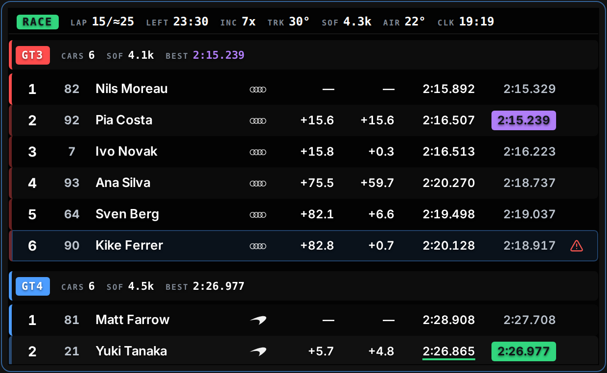

<br>

<div align="center">
  
  <h1>TelemetryLab</h1>
  <p><strong>Real-time iRacing telemetry overlays for your desktop</strong></p>
  <a href="https://github.com/panyu1512/TelemetryLab/releases/latest/download/TelemetryLab-setup.exe">Download</a> •
  <a href="#quickstart">Quickstart</a> •
  <a href="#architecture">Architecture</a> •
  <a href="CHANGELOG.md">Changelog</a>
</div>

<br>

<div align="center">
  
</div>

<br>

<div align="center">
  <strong>Multi-class standings, an on-track relative, fuel strategy and a driving cluster — each in its own always-on-top window.</strong>
</div>

<br>

- ⚡ **Live data straight from the sim** — a Python sidecar reads iRacing's shared memory and streams it over a local WebSocket at ~60 Hz.
- 🪟 **One overlay per window** — frameless, always-on-top, lockable click-through, each remembering its own position and size.
- 🎛️ **Configure with a live preview** — every setting applies instantly to the open overlay. No save step, no restart.
- 🧪 **Develop without a sim** — a mock bridge synthesizes a full multi-class field, so the whole UI runs on macOS and Linux.

<br>

<div align="center">
  
</div>

<br>

<div align="center">
  ⭐️ <strong>If TelemetryLab is useful to you, star the repo</strong> — it is how the project gets found. ⭐️
</div>

<br>

## Contents

- [Why TelemetryLab?](#why-telemetrylab)
- [Install on Windows](#install-on-windows)
- [Quickstart](#quickstart)
- [Architecture](#architecture)
- [Overlay Manager](#overlay-manager)
- [Wire protocol](#wire-protocol)
- [Contributing](#contributing)
- [FAQ](#faq)

<br>

## Why TelemetryLab?

<details>
<summary><b>Overlays that behave like overlays</b></summary>

<br>

Each overlay lives in its own frameless, always-on-top window rather than inside one monolithic dashboard. Lock a window and it becomes click-through and immovable — mouse input passes straight to iRacing — with **Ctrl+Shift+L** toggling the focused one. Position, size and lock state are persisted per window and restored exactly on the next launch.

</details>

<details>
<summary><b>Configuration with an instant live preview</b></summary>

<br>

Selecting an overlay in the manager shows its *entire* configuration on one page — Appearance, Visibility, Window — next to a preview that reflects every change as you make it. Edits propagate to an already-open overlay window in real time over a cross-window event bus. There is no apply button because there is nothing to apply.

</details>

<details>
<summary><b>A protocol built for 60 Hz</b></summary>

<br>

The bridge multiplexes several channels over a single WebSocket, each in a versioned envelope with its own cadence, so the heavy driver roster never ships at frame rate. Stateful channels replay on connect, so a client joining mid-session renders the current world immediately instead of waiting for the next tick. See [Wire protocol](#wire-protocol).

</details>

<details>
<summary><b>You can develop it without owning a race</b></summary>

<br>

iRacing and `pyirsdk` are Windows-only, so the repo ships a mock bridge that synthesizes a full multi-class field. `docker compose up --build` brings up the mock bridge and the Vite dev server together, and the standings, relative and fuel screens can be built end to end on macOS or Linux.

</details>

<details>
<summary><b>Tested where it matters</b></summary>

<br>

The pure logic on both sides of the socket is covered by fast, isolated tests — no sim, no socket, no DOM — plus an integration test that drives the bridge service with a fake source. The bridge sits at ~97% line coverage behind an 85% gate; the frontend covers the formatters, the tyre-heat scale, the wire parser and the full fuel-and-strategy solver. Every push and PR runs both. See [Testing](#testing--quality-gates).

</details>

<br>

## Install on Windows

**[Download TelemetryLab-setup.exe](https://github.com/panyu1512/TelemetryLab/releases/latest/download/TelemetryLab-setup.exe)** and run it. It installs for the current user only — into `%LOCALAPPDATA%`, with no Administrator prompt and no wizard to click through — and opens the app when it finishes.

That link always resolves to the newest release, because the build publishes a copy of the installer under a name that does not carry the version. The versioned `…-setup.exe` and a `.msi` sit beside it on the [release page](https://github.com/panyu1512/TelemetryLab/releases/latest); the `.msi` is the same application packaged for per-machine or managed deployment, and most people do not need it.

<details>
<summary><b>Windows will warn you — here is why, and how to verify the download</b></summary>

<br>

You will see *"Windows protected your PC"* with the publisher listed as unknown. That is expected and it is not a false alarm: the installer is **not code-signed**, so SmartScreen has no publisher to attribute it to and blocks it by default. Choose **More info → Run anyway**.

You do not have to accept that on trust. Every release is built by [`build.yml`](.github/workflows/build.yml) and publishes a `SHA256SUMS.txt` beside the installer, so you can confirm the bytes you downloaded are the bytes that were built:

```powershell
certutil -hashfile .\TelemetryLab-setup.exe SHA256
```

A build-provenance attestation — which proves the file came from this repository's own workflow rather than from whoever handed it to you — is wired up in the same workflow but **only runs while this repository is public**. GitHub bills artifact attestations for private repositories under Enterprise Cloud, so the step is gated rather than left to fail a release. If the repo is public, the release notes carry the `gh attestation verify` command too.

Signing the installer would put a name in that dialog instead of "unknown publisher". It would **not** remove the warning: since 2024 neither OV nor EV certificates bypass SmartScreen, and reputation accrues over time either way. The only route that removes it outright is distributing through the Microsoft Store as an MSIX, recorded as an open question in [the roadmap](ROADMAP.md).

</details>

<br>

## Quickstart

The fastest way to bring up the **dev environment** — mock telemetry plus the React app — is a single command:

```bash
docker compose up --build
# → open http://localhost:1420
```

This runs the mock bridge (`ws://localhost:8765`) and the Vite dev server with hot reload. Edit files under `src/` and the browser updates live. To simulate iRacing connecting and disconnecting, set `MOCK_DISCONNECT_EVERY` in [docker-compose.yml](docker-compose.yml).

> ⚠️ Docker only runs the **development** stack. The Tauri desktop app is a native binary and the **real** bridge needs iRacing's Windows shared memory — neither runs in a Linux container. Those are produced by CI ([`build.yml`](.github/workflows/build.yml)).
>
> No sim handy? Turn on **Mock Data** in the Overlay Manager → *Global Settings* and the whole UI runs on built-in synthetic telemetry — no bridge required.

### Prerequisites for a native setup

- **Node.js** 20+
- **Rust** stable (via [rustup](https://rustup.rs/))
- **Python** 3.11
- Tauri system dependencies — see the [Tauri v2 prerequisites](https://v2.tauri.app/start/prerequisites/). On Windows that means the **WebView2 runtime** and the **MSVC C++ build tools**.

<details>
<summary><b>Develop on macOS / Linux (mock bridge)</b></summary>

<br>

You develop the UI against the mock bridge and run the frontend in a normal browser — the full Tauri shell isn't used here because the sidecar exe is Windows-only.

```bash
# 1. Install frontend deps
npm install

# 2. Start the mock bridge (only needs `websockets`)
pip install websockets
npm run bridge:mock          # → ws://localhost:8765 streaming fake telemetry

# 3. In another terminal, start Vite
npm run dev                  # → http://localhost:1420
```

Open <http://localhost:1420> for the live dashboard, driven by the mock bridge's synthetic field.

Useful tweaks:

```bash
# Simulate iRacing connecting/disconnecting to test the UI states
MOCK_DISCONNECT_EVERY=5 python bridge/mock_bridge.py

# Point the frontend at a bridge on another machine (e.g. a Windows PC
# running the real bridge) without touching code
VITE_WS_HOST=192.168.1.50 VITE_WS_PORT=8765 npm run dev
```

</details>

<details>
<summary><b>Develop on Windows (real iRacing data)</b></summary>

<br>

```bash
# 1. Install frontend deps
npm install

# 2. Install + run the real bridge
pip install -r bridge/requirements.txt
python bridge/bridge.py      # reads iRacing shared memory, serves ws://localhost:8765

# 3. Run the full Tauri app
npm run tauri dev
```

In a packaged build, the Tauri app launches `iracing-bridge.exe` automatically and kills it on exit. During `tauri dev` it tries to spawn the sidecar from `src-tauri/binaries/` — either build it once (below) or just run `python bridge/bridge.py` manually and ignore the "failed to spawn sidecar" log line.

**Build the sidecar locally (optional):**

```bash
cd bridge
pip install -r requirements.txt
pyinstaller bridge.spec
# → dist/iracing-bridge.exe

# Copy it where Tauri expects it (note the required target-triple suffix)
copy dist\iracing-bridge.exe ..\src-tauri\binaries\iracing-bridge-x86_64-pc-windows-msvc.exe
```

**Build the full installer:**

```bash
npm run tauri build
# → src-tauri/target/release/bundle/msi/*.msi
```

</details>

<details>
<summary><b>The download site</b></summary>

<br>

A static download page lives in [`site/`](site/) — plain HTML and two stylesheets, no build step. Serve the folder:

```bash
python3 -m http.server 4173 --directory site   # → http://localhost:4173
```

Its product screenshots are generated from this app on the mock feed; see [`site/README.md`](site/README.md) to re-shoot them after a UI change.

</details>

<br>

## Architecture

TelemetryLab is a Tauri v2 desktop app that supervises a Python sidecar. The sidecar owns everything sim-specific; the frontend only ever speaks WebSocket, which is what makes browser-only development on macOS and Linux possible.

```
iracing-telemetry.exe
├── WebView  → React dashboard (native window)
└── Sidecar → iracing-bridge.exe (Python, reads iRacing shared memory via pyirsdk)
                    ↕ pyirsdk
              iRacing shared memory (Windows)
```

On Windows the real bridge talks to iRacing; on macOS and Linux a mock bridge generates synthetic data so you can develop the UI without a sim.

<details>
<summary><b>Project layout</b></summary>

<br>

```
.
├── site/                     # Static marketing / download page (no build step)
├── src/                      # React frontend (Vite + TypeScript)
│   ├── components/
│   ├── telemetry/            # Wire protocol, typed models, WS connection
│   │   └── protocol.test.ts  # Wire-envelope parser specs
│   ├── stores/               # Zustand stores (session/telemetry/standings/bridge)
│   ├── lib/                  # Pure helpers (format/scales/fuelStrategy) + *.test.ts
│   ├── hooks/
│   │   ├── useBridge.ts      # Owns the WS connection; feeds the stores
│   │   └── useTelemetry.ts   # Single-car compatibility selector
│   ├── config.ts             # Configurable WS host/port (no hardcoded localhost)
│   └── App.tsx
├── src-tauri/                # Tauri (Rust)
│   ├── src/main.rs           # Spawns + supervises the bridge sidecar
│   ├── binaries/             # Sidecar exe goes here (built in CI)
│   ├── capabilities/
│   ├── icons/
│   ├── tauri.conf.json
│   └── Cargo.toml
├── bridge/                   # Python sidecar
│   ├── telemetrylab/         # Shared core: protocol, models, repos, service
│   ├── tests/                # pytest suite (unit + service integration)
│   ├── bridge.py             # Real bridge source (Windows, pyirsdk)
│   ├── mock_bridge.py        # Synthetic multi-car field source (Mac/Linux dev)
│   ├── bridge.spec           # PyInstaller config (onefile, console)
│   ├── pyproject.toml        # pytest / ruff / coverage config
│   ├── requirements.txt      # runtime deps  (requirements-dev.txt = test/lint)
│   └── requirements-dev.txt
└── .github/workflows/
    ├── ci.yml                # Quality gates: lint + typecheck + tests (every push/PR)
    ├── release.yml           # Cut a release: bump + changelog + tag (manual)
    └── build.yml             # Build: Windows installer on version tags
```

</details>

<br>

## Overlay Manager

The main app window is a dedicated **Overlay Manager** — it configures, previews, opens, closes and tracks overlays, and never behaves as an overlay itself. The architecture is deliberately flat:

```
Overlay Manager (main window) → individual overlay windows
```

A sidebar lists every overlay; selecting one shows its entire configuration inline on one page (Appearance / Visibility / Window) with a live preview that reflects every change instantly — no save or apply step. Each overlay is opened and closed directly from the manager into its own frameless, always-on-top window; the manager tracks which overlays are open, and edits propagate to an open overlay window in real time over a cross-window event bus.

Each overlay window remembers its own position, size and lock state and is restored exactly on the next launch — closing the manager closes every overlay window, so nothing is orphaned. Internally a single view is selected with a URL param (`?overlay=<id>` / `?widget=<id>`); a hash form (`#overlay=<id>` / `#/<id>`) is also accepted. During `npm run dev` these open as browser tabs.

**Locking.** Any overlay window can be locked: it becomes click-through (all mouse input passes to iRacing) and immovable. Lock state is persisted per window and propagates to the open window immediately. Press **Ctrl+Shift+L** to toggle the focused overlay window. The manager window is never an overlay and is never locked.

<br>

## Wire protocol

The bridge multiplexes several **channels** over the single WebSocket, each in a versioned envelope so the frontend can route by `type` and pick a different cadence per channel:

```jsonc
{ "v": 1, "type": "telemetry", "ts": 1719936000123, "seq": 4211, "payload": { … } }
```

| Channel     | Cadence              | Payload                                                              |
| ----------- | -------------------- | -------------------------------------------------------------------- |
| `telemetry` | ~60 Hz               | Player car only: speed/rpm/gear, inputs, tyres, current lap.         |
| `standings` | ~5–10 Hz (on change) | Computed field order: positions, gaps, per-car timing, pit state.    |
| `session`   | on change / ~1 Hz    | Driver roster, session/track/weather metadata, flags, SOF.           |
| `bridge`    | on change            | `{ iracingActive }` — replaces the old `{connected:false}` heartbeat. |

Stateful channels (`session` / `standings` / `bridge`) are **replayed on connect**, so a client that joins mid-session renders the current world immediately instead of waiting for the next tick.

The models are defined once and mirrored on both sides:

- Python: [`bridge/telemetrylab/models.py`](bridge/telemetrylab/models.py) (dataclasses) + [`protocol.py`](bridge/telemetrylab/protocol.py).
- TypeScript: [`src/telemetry/types.ts`](src/telemetry/types.ts) + [`protocol.ts`](src/telemetry/protocol.ts).

On the frontend each channel feeds a Zustand store (`useTelemetryStore`, `useSessionStore`, `useStandingsStore`, `useBridgeStore`); the standings store is normalized (`order` + `byIdx`) so 100+ rows only re-render when their own numbers change. `useTelemetry()` remains as a single-car compatibility selector for the existing dashboard widgets.

The mock bridge synthesizes a full field (`MOCK_CARS`, `MOCK_MULTICLASS`) so the session/standings/relative screens can be built entirely on macOS/Linux.

<br>

## Contributing

Issues and pull requests are welcome. Please open an issue before starting anything large, so the design can be agreed first.

### Testing & quality gates

The pure logic on both sides of the WebSocket is covered by fast, isolated unit tests — no sim, no socket, no DOM required — plus a small integration test that drives the bridge service end-to-end with a fake source.

**Python bridge** ([`bridge/`](bridge/)) — [pytest](https://pytest.org) + [ruff](https://docs.astral.sh/ruff/):

```bash
cd bridge
pip install -r requirements-dev.txt
pytest                 # unit + integration suite, coverage gate at 85%
ruff check .           # lint
ruff format --check .  # formatting
```

Tests live in [`bridge/tests/`](bridge/tests/) and cover session parsing, SOF, the CarIdx ingest, the derived-sector timer, the stateful standings engine, the repositories/event bus, and the async service loop (~97% line coverage).

**Frontend** ([`src/`](src/)) — [Vitest](https://vitest.dev) + `tsc`:

```bash
npm install
npm run typecheck       # tsc --noEmit (strict)
npm test                # vitest run
npm run test:coverage   # with coverage thresholds
```

Specs sit next to the code they exercise (`*.test.ts`) and cover the value formatters, the tyre-heat colour scale, the wire-protocol parser, and the full fuel-and-strategy solver.

<details>
<summary><b>Continuous integration and how a release is cut</b></summary>

<br>

Three workflows split the fast feedback loop from the release build.

[`ci.yml`](.github/workflows/ci.yml) is the **quality-gate** pipeline. It runs on every push to `main`/`claude/**` and on every pull request, across two parallel `ubuntu-latest` jobs:

- **bridge** — `ruff check`, `ruff format --check`, and `pytest` with the coverage gate.
- **frontend** — `npm run typecheck`, `npm run test:coverage`, and `npm run build`.

Both roll up into a single `ci` status so branch protection can require one check. Nothing should merge with a red gate.

[`release.yml`](.github/workflows/release.yml) is the **release** pipeline — the decision to ship. Run it from the Actions tab (or `gh workflow run release.yml -f bump=minor`) and pick `patch`/`minor`/`major`, or `custom` with an exact `X.Y.Z`. It re-runs the frontend gates, then:

1. Bumps the version in `package.json`, `package-lock.json`, `src-tauri/tauri.conf.json`, `src-tauri/Cargo.toml` and `Cargo.lock` — all five must move together, since Tauri stamps the `.msi` from `tauri.conf.json`.
2. Converts the CHANGELOG's `## [Unreleased]` section into a dated `## [X.Y.Z]` section and refreshes the compare links. An empty `[Unreleased]` aborts the release: there is nothing to ship.
3. Commits `chore(release): vX.Y.Z`, tags `vX.Y.Z`, pushes both, and dispatches `build.yml` against the new tag.

The bump/extract logic lives in [`scripts/release.mjs`](scripts/release.mjs) (`bump` and `notes` modes) so it can be run and tested outside CI.

[`build.yml`](.github/workflows/build.yml) is the **build** pipeline. It runs on `windows-latest` and:

1. Builds the bridge into a onefile `iracing-bridge.exe` with PyInstaller.
2. Copies it to `src-tauri/binaries/iracing-bridge-x86_64-pc-windows-msvc.exe` (the exact name Tauri requires for a sidecar: `{name}-{target-triple}.exe`).
3. Runs `npm run tauri build` to produce the installer.
4. Uploads it as a workflow artifact, and as a Release asset on tags — with that version's CHANGELOG section as the release body, rather than a dump of commit subjects.

So a release is one button: run `release`, and the installer and release notes follow from the tag it pushes.

</details>

<br>

## FAQ

<details>
<summary><b>Do I need iRacing running to try it?</b></summary>

<br>

No. Turn on **Mock Data** in the Overlay Manager → *Global Settings* and the entire UI runs on built-in synthetic telemetry, with no bridge and no sim.

</details>

<details>
<summary><b>Does it work on macOS or Linux?</b></summary>

<br>

Not as a product — iRacing and `pyirsdk` are Windows-only. As a development environment, yes: the mock bridge and the Vite dev server run anywhere, which is how most of the UI is built.

</details>

<details>
<summary><b>Why do Chinese (or Japanese, Korean, Cyrillic) driver names show as <code>?</code>?</b></summary>

<br>

Because iRacing writes its session string as ISO-8859-1 by default and replaces every character that codepage cannot hold with `?` — the substitution happens inside the sim, before the data reaches shared memory, so no overlay can recover the original name.

Fix it in the sim: close iRacing, open `Documents\iRacing\app.ini`, set `irsdkUTF8SessionStr=1` (under `[Misc]`), and restart. The bridge logs a reminder with these steps whenever it connects to a session that is not UTF-8.

</details>

<details>
<summary><b>Why does Windows say the publisher is unknown?</b></summary>

<br>

The installer is not code-signed, so SmartScreen has no publisher to attribute it to. Choose **More info → Run anyway**, and verify the SHA-256 against the `SHA256SUMS.txt` published with the release if you want proof of what you downloaded. Details in [Install on Windows](#install-on-windows).

</details>

<details>
<summary><b>Can the frontend talk to a bridge on another machine?</b></summary>

<br>

Yes. Nothing hardcodes localhost — set `VITE_WS_HOST` and `VITE_WS_PORT`, for example to run the UI on a second monitor machine while the bridge sits on the sim PC.

</details>

<details>
<summary><b>Why a Python sidecar instead of reading the shared memory from Rust?</b></summary>

<br>

`pyirsdk` already handles iRacing's shared-memory layout and session YAML, which is the fiddly part. The sidecar keeps that dependency isolated behind a WebSocket, so the frontend has no sim-specific code at all and can be developed and tested off Windows.

</details>

<br>

<div align="center">
  <sub>Not affiliated with or endorsed by iRacing.com Motorsport Simulations, LLC.</sub>
</div>
